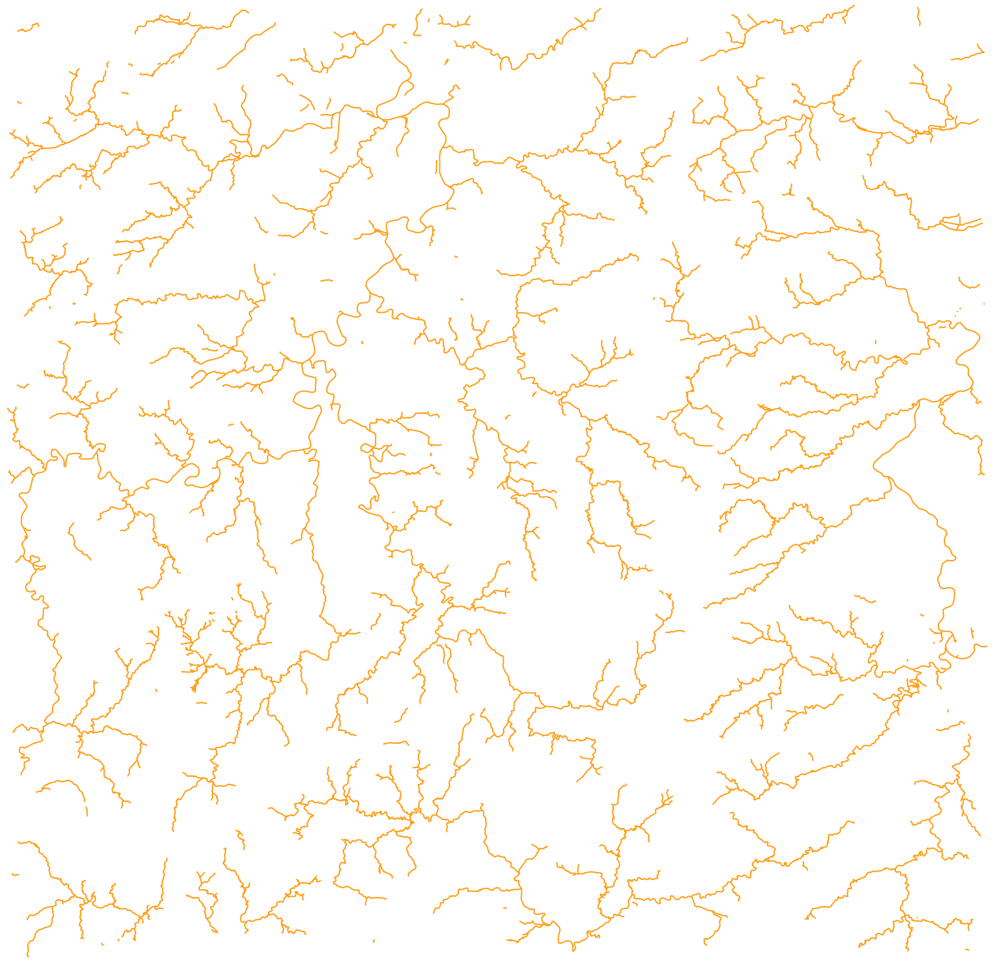

# Multi-Instance-Zero-Watermarking

## Experimental Data
- **Waterways**: `waterways.shp`, `waterways.dbf`, `waterways.prj`, `waterways.shx`

The Shapefile dataset contains waterways vector geographic data. Below is a visualization of the `waterways.shp` file:

